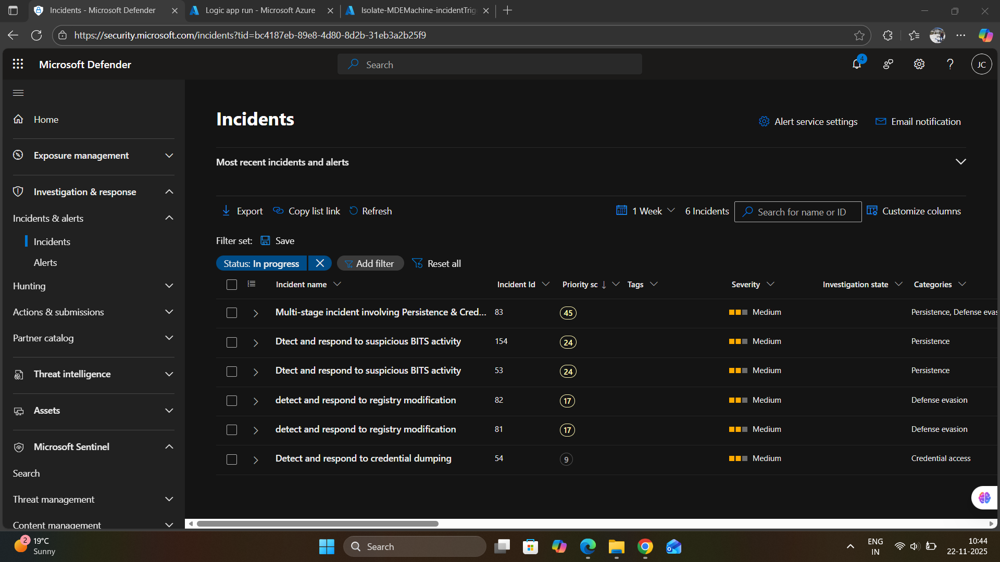
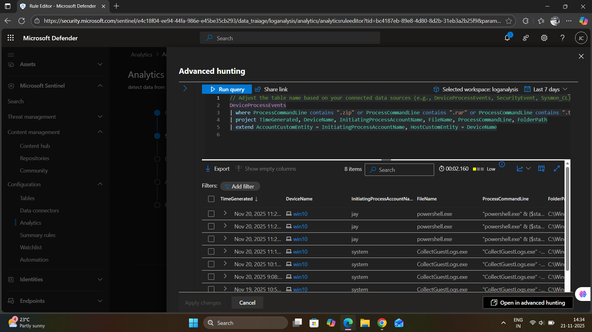
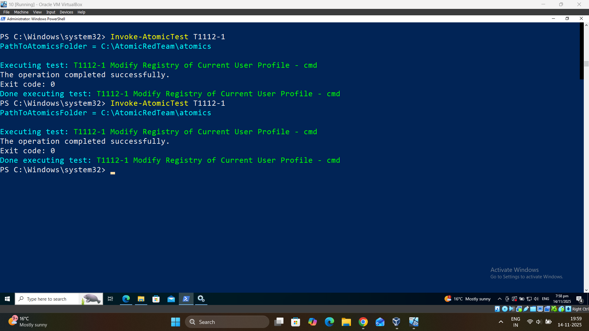
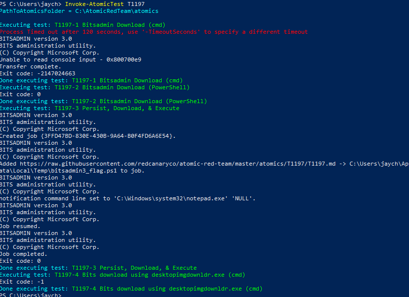

# Atomic Red Team Detection & Response Lab

## Overview

This project demonstrates a comprehensive approach to detection engineering using the Atomic Red Team framework. The lab focuses on identifying detection gaps, developing custom KQL-based analytics rules, and implementing automated incident response workflows in Microsoft Sentinel and Defender for Endpoint.

--> Block VM access

--> Incidents

--> Detection Query

--> Atomic red team

## Objectives

- Test endpoint detection capabilities using Atomic Red Team
- Develop custom detection rules aligned with MITRE ATT&CK framework
- Build automated response playbooks for high-fidelity threats

## Lab Environment

### Infrastructure
- **SIEM/SOAR**: Microsoft Sentinel
- **EDR**: Microsoft Defender for Endpoint
- **Test Environment**: Windows 10/11 VMs 
- **Log Sources**: Sysmon, Windows Event Logs, MDE telemetry
- **Testing Framework**: Atomic Red Team

### Data Connectors
- Microsoft Defender for Endpoint
- Windows Security Events via AMA (Azure Monitor Agent)
- Sysmon (Event ID 1, 12, 13)

## MITRE ATT&CK Coverage

This lab covers the following tactics and techniques:

| Tactic | Technique | Sub-Technique | Detection Rule |
|--------|-----------|---------------|----------------|
| Persistence | T1197 | BITS Jobs | BITS Activity Detection |
| Defense Evasion | T1112 | Modify Registry | Registry Modification Detection |
| Credential Access | T1003 | OS Credential Dumping (.001-.006) | Credential Dumping Detection |
| Collection | T1005 | Data from Local System | Data Archival Detection |

## References

- [Atomic Red Team](https://github.com/redcanaryco/atomic-red-team)
- [MITRE ATT&CK Framework](https://attack.mitre.org/)
- [Microsoft Sentinel Documentation](https://docs.microsoft.com/en-us/azure/sentinel/)
- [Sysmon Configuration](https://github.com/SwiftOnSecurity/sysmon-config)
